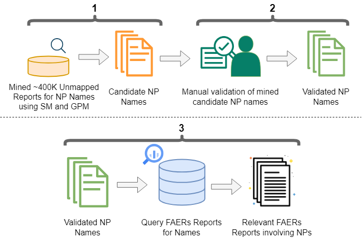

# np_name_finder

A project to use different computational approaches to identify natural product mentions in unstructured character strings.

This repository contains the experiments and data used for the: "Broadening the Capture of Natural Products Mentioned in FAERS Using a Combined Approach" manuscript. The `experiment` directory contains all the code necessary to reproduce the work. The `data` directory contains the data files utilized for the work along with a readme.txt describing each data file. The `evaluation` directory contains all the relevant code utilized during the evaluation and results files used during the manual validation.

The work was run using Python 3.10 and Tensorflow 2.10.0 with the parameters utilized for the experiments recorded in the LSTM65.yaml config file.
